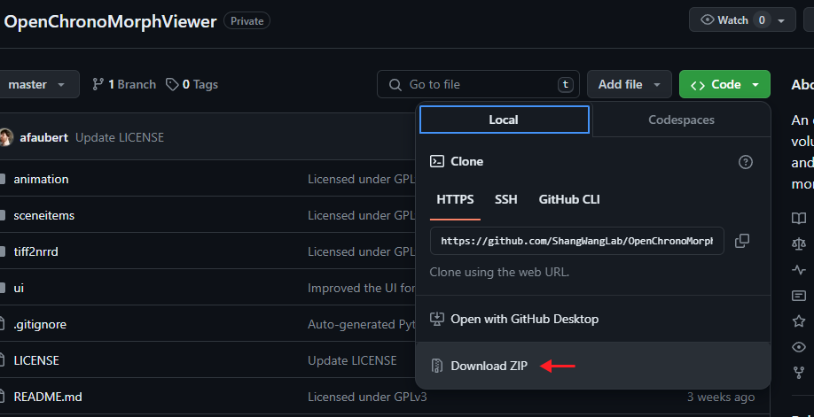

# Installation instructions
OCMV requires a standard installation of Python, along with some 3rd party libraries. Animation frames can be made without FFmpeg, but they cannot be compiled into a video file through OCMV without FFmpeg installed and added to the environment variables.
This installation process should take 5-10 minutes.

## Required software
- Python version 3.11.4
- FFmpeg version 6.1.1 (only required for animating videos)

Required 3rd party Python packages
- NumPy 1.25.2 for 3D data operations
- PSutil 5.9.5 for getting the current RAM usage
- PyNRRD 1.0.0 for the image file format (Nearly Raw Raster Data)
- PyQt5 5.15.2.2.3 for the user interface
- PyVTK 9.2.6 for volumetric rendering
- SciPy 1.11.1 for the "cdist" function used in the clipping spline
- TIFFfile 2023.7.18 for parsing TIFF files

See [dependency-install-Windows.bat](/dependency-install-Windows.bat) for 
an example of the command to install all the Python dependencies.

## Windows 10/11

### Option #1
A binary distribution is available for Windows. If you would like to use the binary version, just [download it](release/OCMV-1.0-Win64.zip)
and extract the zip archive anywhere. If you merely want to view files, you may stop here. However, the binary distribution cannot be used to write animations scripts; for those, you must continue to install the Python requirements along with FFmpeg.

### Option #2
Install Python with dependencies:
1. Download and open the latest version of the Python installer from https://www.python.org/downloads/windows, found under "Download Windows installer (xx-bit)". This should usually be the 64-bit version. Python version 3.10+ is required, while 3.11 is the best-tested version.

2. Check the box to add python.exe to PATH. If you already have an installation of Python, this may cause issues with overlapping installation names.

3. "Click Install Now" or make a custom installation. If the latter, make sure not to uncheck the box to also install pip, and do not uncheck the option to add Python to the environment variables.
4. Clone the OCMV GitHub repository to your computer and extract the ZIP file, if necessary.

5. Run "dependency-install-Windows.bat" to install the required Python packages using pip.

Install FFmpeg (optional):
1. Go to https://github.com/BtbN/FFmpeg-Builds/releases and download "ffmpeg-master-latest-win64-gpl.zip".

2. Extract the zip somewhere permanent, like, "C:\Program Files\ffmpeg\".
3. Add the bin directory to your path: "Edit the system environment variables" in the Start menu (under "Settings/About/Advanced system settings"), select "Environment Variables…", double-click on "Path" for either the User or System variables, and add an entry for the "bin" subdirectory, e.g., "C:\Program Files\ffmpeg\bin".


Run OCMV:
1. Open the OCMV repository previously downloaded and double-click on "run-OCMV-Windows.bat" to start the software.

## macOS 13.0+
Install Python with dependencies:
1. Install the latest version of Python from https://www.python.org/downloads/macos, found under "Download macOS 64-bit universal2 installer". Python version 3.10+ is required.

2. Double-click the installer to install Python. If you already have an installation of Python, this may cause issues with overlapping installation names.
3. Run "Update Shell Profile.command" under the new installation directory by double-clicking it.
4. Clone the OCMV GitHub repository to your computer and extract the ZIP file, if necessary.

5. Open a terminal and navigate to your OCMV folder using the "cd" command.
```bash
cd ~/Downloads/OpenChronoMorphViewer-master/
```
6. In the terminal, use "chmod" to acquire permission to execute the OCMV files.
```bash
chmod +x *
```
7. In the terminal, run "./dependency-install-macOS.command" to install the required Python packages using pip.

Install FFmpeg (optional):
1. Go to https://evermeet.cx/ffmpeg and, under "ffmpeg-x.x.x.7z" on the right, click "Download as ZIP".

2. The ZIP file should contain a single executable called "ffmpeg". Extract the ZIP file and move ffmpeg to "/usr/local/bin/".

Run OCMV:
1.	Open the OCMV repository previously downloaded and double-click on "run-OCMV-macOS.command" to start the software.

## Ubuntu 20.04+
Install Python with dependencies:
1. Open a terminal.
2. Add the deadsnakes PPA, which provides specific version builds of Python for Ubuntu.
```bash
sudo add-apt-repository ppa:deadsnakes/ppa
```
3. Now that Python version 3.11 can be located, install it.
```bash
sudo apt-get install python3.11
```
4. Install the correct version of the Python package manager, PIP.
```bash
wget https://bootstrap.pypa.io/get-pip.py
sudo python3.11 get-pip.py
rm get-pip.py
```
5. Install the required Python libraries. Sometimes, an existing library will cause installation issues, so we recommend forcibly reinstalling them.
```bash
python3.11 -m pip install --force-reinstall numpy psutil pynrrd pyqt5 scipy 
vtk tifffile
```
6. Clone the OCMV GitHub repository to your computer and extract the ZIP file, if necessary.

 
Install FFmpeg (optional):
1. FFmpeg usually comes prepackaged with Ubuntu repositories. If it is missing, you can install it with apt-get.
```bash
sudo apt-get install ffmpeg
```

Run OCMV:
1. Navigate a terminal to the OCMV repository previously downloaded and run:
```bash
python3.11 openchronomorphviewer.py
```